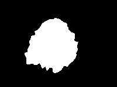
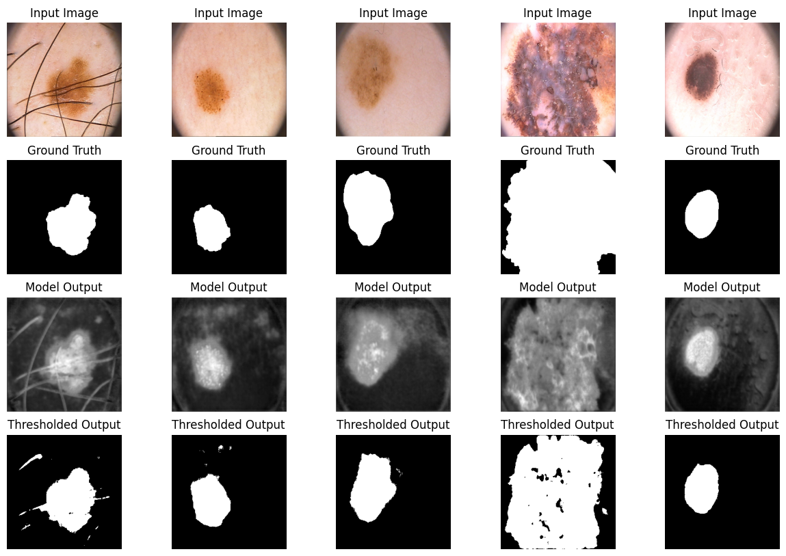

# Semantic Segmentation of Skin Lesions (Семантическая сегментация кожных поражений)

## Описание

В данном проекте проводится семантическая сегментация изображений кожных поражений, таких как меланома и родинки. Основная цель — выделение области поражения на изображении. Для решения задачи используются архитектуры нейронных сетей SegNet и U-Net с различными функциями потерь.



## Актуальность задачи

С увеличением заболеваемости кожными раковыми образованиями, таким как меланома, становится критически важным раннее выявление и точная диагностика. Реализованная система сегментации при должной доработке может значительно помочь дерматологам в анализе поражений кожи, а также, например, быть использована в научных исследованиях для изучения различных типов кожных заболеваний.

**Задачи проекта**:
- Предобработка данных:
  - Изменение размера изображений до 256x256.
  - Нормализация изображений в диапазоне [0, 1].
  - Разделение данных на обучающую, валидационную и тестовую выборки (100/50/50).
- Обучение моделей:
  - Реализация архитектур SegNet и U-Net.
  - Использование различных функций потерь: BCE Loss, Dice Loss, Focal Loss.
  - Оптимизация гиперпараметров.
- Оценка моделей:
  - Использование метрики IoU (Intersection over Union).
  - Сравнение моделей по качеству предсказаний и времени обучения.

---

## Подробнее

[Посмотреть ноутбук можно здесь](semantic_segmentation.ipynb)

---

## Используемые библиотеки и методы анализа

### Библиотеки:
- **pandas**, **numpy** – обработка данных.
- **matplotlib**, **seaborn** – визуализация данных.
- **scikit-learn** – метрики качества.
- **torch**, **torchvision**, **torchmetrics** – обучение моделей, функции потерь, метрики.
- **segmentation-models-pytorch** – дополнительные реализации функций потерь.

### Методы анализа:
- **ML/DL**:
  - Архитектуры: SegNet, U-Net.
  - Функции потерь: BCE Loss, Dice Loss, Focal Loss.
  - Метрика качества: IoU (Intersection over Union).
- **Визуализация результатов**:
  - Отображение исходных изображений, истинных масок и предсказанных масок.
  - Построение графиков потерь и метрик по эпохам.

---

## Основные результаты
- **SegNet** с функцией потерь **BCE Loss** показала наилучший результат по метрике IoU (0.7511).
- **U-Net** с функцией потерь **Focal Loss** показала наименьший лосс (0.0702).
- Время обучения моделей SegNet меньше, чем у U-Net, при использовании одинаковых функций потерь.
- Визуально обе модели хорошо сегментируют области поражений.



---

## 🔧 Установка

Для работы с проектом потребуется **Python 3.x** и следующие библиотеки:

```bash
pip install pandas numpy matplotlib seaborn scikit-learn torch torchvision torchmetrics segmentation-models-pytorch
